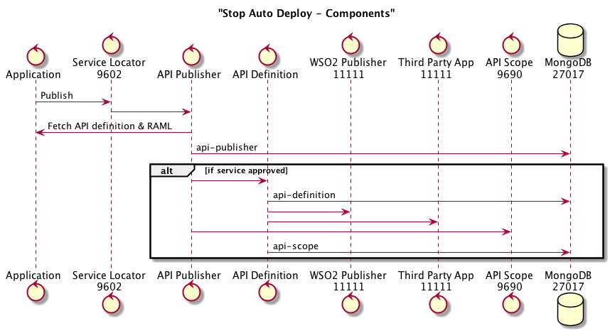

# API Gatekeeper Frontend

[](https://travis-ci.org/hmrc/api-gatekeeper-frontend) [  ](https://bintray.com/hmrc/releases/api-gatekeeper-frontend/_latestVersion)

This service provides a frontend HMRC's internal users to vet requests to create applications 
as part of our HMRC third party tax software and [application programming interface (API) strategy](http://developer.service.hmrc.gov.uk/api-documentation).

## Summary

This service provides the following functionality:

* Ability to log in / log out with an internal user
* Role based access control for actions

## Requirements 

This service is written in [Scala](http://www.scala-lang.org/) and [Play](http://playframework.com/), so needs at least a [JRE] to run.

## Run the application

To run the application use the `run_local_with_dependencies.sh` script to start the service along with all of
the back end dependencies that it needs (which are started using Service Manager). You will need to have added
a suitable user in the Auth database in your local MongoDB. 

Once everything is up and running you can access the application at

```
http://localhost:9684/api-gatekeeper/login
```

Alternatively, the `run_in_stub_mode.sh` script will run the service in "stub" mode against mocked back end services.

## Unit tests
```
sbt test
```

## Acceptance tests
```
sbt acceptance:test
```

### License

This code is open source software licensed under the [Apache 2.0 License]("http://www.apache.org/licenses/LICENSE-2.0.html").

## ZAP testing
Once the api-gatekeeper-frontend is running locally, it can be tested using OWASP Zed Attack Proxy (ZAP) which is a security tool that can be used to highlight any potential vulnerabilities: - 
* Download and install [ZAP](https://www.owasp.org/index.php/OWASP_Zed_Attack_Proxy_Project).
* Install the latest scanners for ZAP by `Managing Add-ons` and adding `Active scanner rules (beta)` 
* Ensure your local machine has Web Proxy (HTTP) enabled and local host set to the Port ZAP is running on (e.g.`11000`).
* ZAP can be started to run on a specific port by running `/Applications/OWASP\ ZAP.app/Contents/Java/zap.sh -port 11000` in terminal.

Various security tests can be run within ZAP and the different types of attacks are dependent on the service under test. In order to setup different tests and reporting thresholds: -
* Navigate to the `Scan Policy Manager` within the `Analyse` menu option.
* Within the `Scan Policy Manager` create a new policy and set the different reporting and attack thresholds.
* Providing the proxy settings above are set, ZAP can monitor the local requests when certain user actions are completed.
* Once the request appears in ZAP, right click on it and select `Attack` and `Active Scan`
* Select the policy tab and set the appropriate policy for the service under test.
* Select to start the scan.
* Once the scan is complete the security tests run against the service are displayed in the ZAP interface.
* Reports can also be generated and saved in various formats from the ZAP Report menu option.
* When running Zap tests on api-gatekeeper-frontend, the following user actions are an example of what can be included in the tests:
  * Login 
  * Filter App 
  * Check App 
  * Approve App
  * Decline App 
  * Filter Dev 
  * View Dev 
  * Logout

## Testing approach

* Unit tests should make up the majority of tests so that test coverage should drop marginally when run against only unit tests.
* Acceptance tests should be a thin layer of coverage on happy paths only to ensure that journeys hang together.

## API Service Approval (Permitting/Denying new applications to run)

Stop Auto Deploy aims to prevent the automatic deployment of new third party microservices without the prior approval/knowledge of SDST.  When the first version of a previously unknown microservice is deployed into Production it will need to be approved by SDST **before** it is available to be accessed by a third-party.

To achieve this the publication process checks that the microservice is known & has been approved before the details of the service are written to the api-definition database.  If the service is unknown then a Pending Approval record is created and the approval of this record will then trigger the full publication of the api-definition.

### What uses this aspect of Gatekeeper?
* SDST (The support Team)
* API Publisher (Checks if approved application on startup)

### API Publisher interaction
The API Publisher is notified by the service-locator when a microservice is deployed.  This publish message contains a link back to the service that is being deployed so that the details of the api-definition etc can be retrieved.  The publication process checks to see if there is already a record for the microservice in the ApiAprroval repository.  If this record exists and is flagged as approved (or if stop autodeploy is disabled) then the publication process will continue and the api-definition etc will be published, if not an unapproved record will be created in the ApiApproval repository and the publication process will stop.

### Diagrams
#### API Service Approval

#### Stop AutoDeploy Components


### Mongo - API Approval Database

A MongoDB Collection exists (DB: api-publisher, Collection: apiapproval) which contains summary details of all known (i.e. both approved and unapproved) microservices.  This information contains the following properties:

  * **serviceName** - Unique name of the microservice e.g. third-party-application
  * **serviceUrl** - URL to the deployed microservice.  This is used to retrieve the RAML of the service when it is approved.
  * **name** - Descriptive, readable name of the microservice e.g. "Third Party Applications"
  * **description** - Brief description of the service.
  * **approved** - Boolean flag to indicate if the microservice has been approved.  *NB If Stop Auto Deploy is disabled then this is automatically set to true.*

### Example mongo Data
```
{ "serviceName" : "individual-benefits", "serviceBaseUrl" : "http://individual-benefits.example.internal", "name" : "Individual Benefits", "description" : "Benefit–based services, such as retrieval of benefits information." }
{ "serviceName" : "individual-tax", "serviceBaseUrl" : "http://individual-tax.example.internal", "name" : "Individual Tax", "description" : "Tax–based services, such as retrieval of annual personal and employment-related tax liabilities and refunds." }
```
### Example mongo Queries
Stop Auto Deploy Queries

#### Find service scope
```
use api-scope
db.getCollection('scope').find({ "key": "stop-autodeploy" })
```
#### Find API approval
```
use api-publisher
db.getCollection('apiapproval').find({ "serviceName": "api-stop-autodeploy-test" })
```
#### Find API definition
```
use api-definition
db.getCollection('api').find({ "serviceName": "api-stop-autodeploy-test" })
```
#### Find all approved APIS
```
use api-publisher
db.getCollection('apiapproval').find({ "approved": true })
```
#### Find all unapproved APIS
```
use api-publisher
db.getCollection('apiapproval').find({ "approved": false })
```
#### Remove service scope
```
use api-scope
db.getCollection('scope').remove({"key":"stop-autodeploy"}, 1)
```
#### Remove api approval
```
use api-publisher
db.getCollection('apiapproval').remove({ serviceName: "api-stop-autodeploy-test" }, 1)
```
#### Remove api publisher
```
use api-definition;
db.getCollection('api').remove({ serviceName: "api-stop-autodeploy-test" }, 1)
```

### Enabling Stop Auto Deploy

By default, Stop Auto Deploy is disabled and so microservices can be deployed without going through the additional approval step.  In order to enable Stop Auto Deploy in a specific environment the 'preventAutoDeploy' feature flag in the api-publisher.yaml in the config for the environment will need to be set to true

In **api-publisher.yaml**
```
  hmrc_config:
    ...
    Prod.features.preventAutoDeploy: 'true'
```

The api-publisher service will need to be redeployed to pick up this configuration change.

---

### Test in QA

Regression tests need to work through a number of combinations of the following conditions:

#### Service
* New
* Existing (and already Approved)
* New Version (and already approved)

#### Stop Autodeploy enabled/disabled (flag)
* Enabled
* Disabled
* Not Present (Default)
